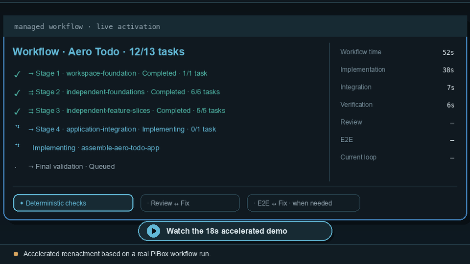
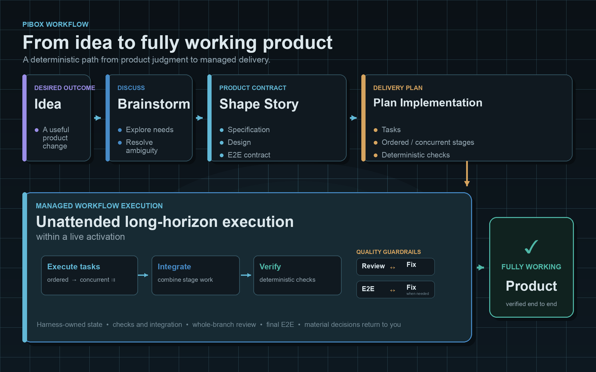

# PiBox

PiBox is a small extension pack for the [Pi coding agent](https://github.com/badlogic/pi-mono): a cool-steel TUI, useful provider integrations, sound feedback, and an optional managed workflow.

## Included

- **`rattle` theme** — cool-steel colors for Pi.
- **TUI extensions** — responsive status bar, refined chat input with a clickable fullscreen return-to-bottom action, compact tool previews/diffs, animated working status, and startup display.
- **Repository permissions** — Claude Code-style `.pi/permissions.yaml` rules with enforced/bypass modes, inherited child state, and `Shift+Tab` switching.
- **Providers** — Ollama Cloud and custom OpenAI-compatible local endpoints, variable Codex subscription-usage status, and transparent same-tier provider fallback for spawned agents. Local endpoints integrate with Pi's native `/thinking` levels.
- **Sound hooks** — optional response, workflow task-completion, and workflow-attention feedback using user-supplied audio.
- **Context rules** — Claude-compatible path-scoped instructions loaded only after matching files are read, from `.claude/rules/` or `.pi/rules/`.
- **Workflow** — collaborative story shaping, capability-backed delivery planning, delegated worktrees, runtime-owned final verification, and recovery. See [docs/workflow.md](docs/workflow.md).
- **Architecture visualizer skill** — agent-authored JSON rendered as a live, interactive local browser diagram with deterministic automatic layouts.
- **Designer profile and visual mockups** — `pi --profile designer` adds repository-aware visual refinement instructions, closest-ancestor `DESIGN.md` authority, and a live browser canvas for mockups under `design/`.
- **Local service adapter** — lazy, health-checked lifecycle management for shared Mem0 and SearXNG services plus the session-scoped visual companion.
- **Repository memory** — explicit curated Mem0 writes, bounded recall, and an advisory `/memory-audit` with no silent mutation.
- **Knowledge distillation** — `/distill` resolves arbitrary code/time/workflow/session ranges into local evidence packets and user-reviewed promotion or demotion proposals without depending on one memory backend.

## Workflow: from idea to working product

[](docs/assets/workflow-demo/workflow-demo.gif)

[Watch the 18-second accelerated terminal demo.](docs/assets/workflow-demo/workflow-demo.gif)

> **Accelerated reenactment based on a real PiBox workflow run.** Playback is opt-in; the terminal scenes faithfully compress its lifecycle and the final screen is the Aero Todo application delivered by that run.

PiBox turns an open-ended request into an explicit product contract before implementation begins. You brainstorm with the main agent, shape a Markdown-rich story with specification, design, and outside-in E2E cases, then review a separate implementation plan. Nothing executes until you explicitly start the reviewed workflow.



Once started, the workflow is designed for **unattended long-horizon execution within a live Pi activation**. It schedules sequential and concurrent stages in isolated Git worktrees, runs deterministic checks, integrates only verified contributions, and performs scoped and whole-branch review. Ordinary defects stay inside bounded **review ↔ fix** and **E2E ↔ fix** loops; material decisions, critical risk, and exhausted recovery return to the user instead of letting implementation silently drift.

The result is not merely completed tasks: it is a working branch that has crossed its authored checks, review guardrails, and complete E2E contract. See [Workflow setup and execution](#workflow-setup-and-execution) and [docs/workflow.md](docs/workflow.md) for the operational model.

## Install and verify

```bash
npm install
npm run verify
```

Pi loads the package extensions listed in `package.json`. For a local preview without globally configured extensions:

```bash
pi --no-extensions \
  -e ./extensions/permissions/index.ts \
  -e ./extensions/tui/chat-input/index.ts \
  -e ./extensions/tui/status-bar/index.ts \
  -e ./extensions/tui/styled-outputs/index.ts \
  -e ./extensions/tui/spinners/index.ts \
  -e ./extensions/tui/startup/index.ts \
  --theme ./themes/rattle.json
```

## Thinking levels

PiBox uses Pi's native thinking controls. Use `/thinking`, `/thinking high`, or `/settings` to select a model-compatible level. `/thinking` changes only the current session unless you press `Ctrl+S` in its selector to save the global default. Global and repository defaults use Pi's standard `~/.pi/agent/settings.json` and `.pi/settings.json` hierarchy:

```json
{
  "defaultThinkingLevel": "medium",
  "modelThinkingLevels": {
    "openai-codex/gpt-5.6-luna": "high"
  }
}
```

PiBox's local OpenAI-compatible provider advertises `off`, `low`, `medium`, `high`, and `xhigh`; Pi automatically hides unsupported `minimal` and `max` choices. The former PiBox `effort.yaml` files and `/effort` command are no longer supported; migrate their values to Pi settings. PiBox uses `Shift+Tab` for permission mode, so set `"app.thinking.cycle": []` in `~/.pi/agent/keybindings.json` to remove Pi's stock binding while keeping `/thinking` available.

## Provider capacity and usage

Spawned agents traverse the ordered, usable routes for their selected capability tier in the active model-tier-list profile. `/tier-profile` switches the session between the built-in `performance` and `token-conservative` profiles or any additional profile declared in `.pi/harness.yaml`; an optional global `modelTierListProfiles.defaultProfile` Pi setting selects the new-session default. Rate/subscription limits, authentication failures, exhausted provider retries, and bounded transport/server failures place the failed provider on cooldown and transparently continue with the next same-tier provider. Foreground calls remain pending; failed intermediate output is not sent to the main session. Strict concrete-model requests never fall back, and context, cancellation, protocol, tool, or implementation failures do not trigger a provider change.

When the active `openai-codex` model uses OAuth subscription authentication, PiBox reads the account's variable rate-limit windows and appends concise percentage/reset information after the existing context gauge. Zero, one, or multiple windows are supported; the entire appended area is hidden when reliable usage is unavailable or does not fit. Ollama Cloud currently exposes no reliable account-quota API, so its integration records `429`/`Retry-After` capacity signals without displaying fabricated quota percentages.

## Repository permissions

Repository policy lives at `.pi/permissions.yaml` and supports `allow`, `ask`, and `deny` decisions for file, Bash, MCP, and extension tools. Restrictive matches win. Enforced mode prompts only in the interactive TUI and denies unattended asks; bypass permits tools without evaluating the repository tool permission policy. `Shift+Tab` and `/permissions` switch the session-scoped mode, and every spawned PiBox child inherits its parent's mode.

When the session is not already in bypass, managed workflows launch only after the extension-owned permission-bypass confirmation. `workflow_start` validates topology and prerequisites before showing it, and child-launching resume uses the same guard. Cancellation launches nothing and does not mutate execution state. Permission bypass does not bypass PiBox workflow authority, Git isolation, reviews, verification, or recovery. See [extensions/permissions/README.md](extensions/permissions/README.md).

## Context rules

Rules without `paths:` frontmatter apply on every agent start. Scoped rules load after the agent reads a matching file, avoiding an up-front dump of unrelated instructions:

```markdown
---
paths: ["src/**/*.ts"]
---

# TypeScript rules

Use strict types at public boundaries.
```

Project rules live under `.claude/rules/` or `.pi/rules/`; user rules live under `~/.claude/rules/` or `~/.pi/agent/rules/`. Rule and skill reads use compact `Loaded …` transcript rows. See [extensions/rule/README.md](extensions/rule/README.md).

## Local services and memory

`/services` reports the machine-scoped Mem0 and SearXNG services alongside the session-scoped visual companion. Services start lazily, use independent health probes, and never update during startup. In the fullscreen footer, `Alt+Down` enters interactive settings; arrow keys navigate Permissions, Effort, Tier, Fast, and services, while Enter opens a shared detail/settings overlay. Up from the first footer row exits; Escape is swallowed in the footer grid and safely closes an open popup. `/memory-start`, `/memory-stop`, and `/memory-status` manage Mem0 directly; automatic recall injects scored repository memories ephemerally into main-agent and spawned-subagent runs; `/memory-debug` explains the latest selection; and `/memory-audit` performs bounded advisory review without changing records. See [extensions/tui/interactive-footer/README.md](extensions/tui/interactive-footer/README.md), [extensions/service-adapter/README.md](extensions/service-adapter/README.md), and [extensions/memory-adapter/README.md](extensions/memory-adapter/README.md).

## Knowledge distillation

`/distill` previews an exact immutable scope before collecting bounded Git, workflow, guidance, and selected main-session evidence under ignored `.pibox/distill/`. Activation-private standalone child transcripts are never recovered. Dedicated read-only distillers produce proposals; optional providers such as Mem0 support claim comparison; instruction promotion is exceptional, example-free, and measured for always-loaded context cost. See [extensions/distill/README.md](extensions/distill/README.md).

## Architecture visualizer

Invoke `/skill:architecture-visualizer` to explore a codebase and create a live visual explanation. The skill writes a flexible JSON document while its local renderer owns layout, grouping, arrows, and interaction. The `visual_companion` tool starts or stops one random-port loopback backend per Pi session; updating the JSON during later conversation automatically refreshes the open page. Session shutdown closes the in-process server, and its listener/watchers are unreferenced so they cannot keep Pi alive after an abrupt quit. The footer includes it in the compact service row, using a neutral dim `○` while intentionally stopped.

## Designer profile and visual mockups

Start a dedicated design session with:

```bash
pi --profile designer
```

Omitting `--profile` (or using `--profile default`) preserves the normal Pi session. Profiles are fixed at startup; PiBox does not switch them mid-session. In the designer profile, PiBox snapshots the closest `DESIGN.md` found from the current working directory up to the repository root and appends it as repository design authority. Restart or `/reload` to pick up a changed `DESIGN.md`.

The editable designer system prompt lives at [`prompt/designer.md`](prompt/designer.md). It stays focused on repository-aware visual exploration and directs rapid iteration under `design/prototypes/<name>/` through the Visual Companion `mockup` viewer. The designer extension conditionally loads the dedicated [`designer-handoff` skill](skills/designer-handoff/SKILL.md) only for `--profile designer`; its instructions remain progressively disclosed until the user asks to deliver, finalize, or regenerate a handoff. The skill then requires script-first batch generation, exactly one independently implementable component instance in one variant/state per file, optional isolated motion keyframes, visual inspection of every output, and a lean `handoff.md` that points implementation agents to the images. Browser MCP is a narrow fallback when the available repository or temporary capture scripts cannot produce a required reference. Other installed Pi skills remain progressively disclosed and may be used when relevant.

The mockup viewer accepts either a single HTML file or a directory containing `index.html`. It serves only that bounded prototype tree, reloads the open canvas when files change, and uses the same session-local loopback backend as Story Board and Architecture.

[`examples/visual-diff/`](examples/visual-diff/) contains a copyable, report-first ODiff wrapper. It compares one rendered reference with one project-generated implementation image, emits compact JSON plus a diff PNG, and optionally applies a project-selected maximum difference percentage. PiBox does not prescribe the project's screenshot framework, capture process, file pairing, or verification policy.

## Sound feedback

The default EVE Online manifest maps three feedback boundaries:

- Pi response settled;
- managed workflow task contribution completed;
- managed workflow paused for failure or user/orchestrator attention.

Audio is not distributed with PiBox. Install user-supplied files under `~/.pi/agent/pibox/sounds/eve-online/`; see [extensions/feedback/sound-hooks/README.md](extensions/feedback/sound-hooks/README.md) for filenames, configuration, and the local-copy example. Copyrighted media must remain untracked.

## Workflow setup and execution

```text
/harness init [standard|economy]
/workflow status

Discuss and shape the story, review the persisted story, then create and review the delivery plan.
After reviewing the plan, say “start the workflow” to execute it.
```

Stories persist Markdown-rich structured contracts in `story.yaml`: specification sections Outcome, Scope, Behavior, and Acceptance; design sections Approach, Boundaries and Flow, and Failure and Verification; plus concise `E2E-NNN` cases with Exercise, Oracle, and Proof. The orchestrator edits them through flat `story_write` and per-case `e2e_write` tools. Delivery remains a separate reviewed `plan.yaml`, authored one task or stage at a time through `task_write` and `stage_write`; near-zero-argument `workflow_compile` validates the current branch without starting work. Each task is one concise YAML context capsule with `description`, `scope`, and `delivery` plus deterministic `checks`. `task_clarify` is an exceptional bounded line-read/literal-search surface over story `spec` or `design`. Ordered stages run task sets sequentially or concurrently and may add optional review mode/focus; only harness `limits.repairRounds` controls repair retries. The planner authors no evaluations, reports, handoffs, or repair tasks—the runtime owns repair slots, whole-branch review, and final E2E.

For ad hoc delegation, `general-purpose` handles open-ended assignments with every configured child tool except workflow and recursive subagent controls; specialized definitions remain available for exploration, investigation, review, and managed execution. Agent-definition frontmatter is the sole tool allowlist authority; `harness.yaml` tool lists are ignored. Its `tools` field supports `"*"` as a union-friendly all-tools selector and optional `mcp:<server>` selectors backed by the independently installed `pi-mcp-adapter`. Missing explicitly selected servers are ignored, while launched children without `"*"` scope the adapter proxy to only declared server names.

MCP transport and updates remain user-owned. Install `pi-mcp-adapter` separately and register server names such as `playwright` and `context7` in its standard `mcp.json`; PiBox does not bundle MCP clients or server versions.

See [docs/workflow.md](docs/workflow.md) for setup and behavior, and [docs/specs/visual-tui.md](docs/specs/visual-tui.md) for visual contracts.

### Workflow execution benchmark

```bash
npm run eval:workflow # deterministic target stage-state scenarios
```

Focused unit and adapter tests cover Git, recovery, permission, review/repair, and completion boundaries. Retained files in `benchmarks/workflow-execution/` are historical evidence. See [docs/workflow-execution-eval.md](docs/workflow-execution-eval.md).

## License

MIT
