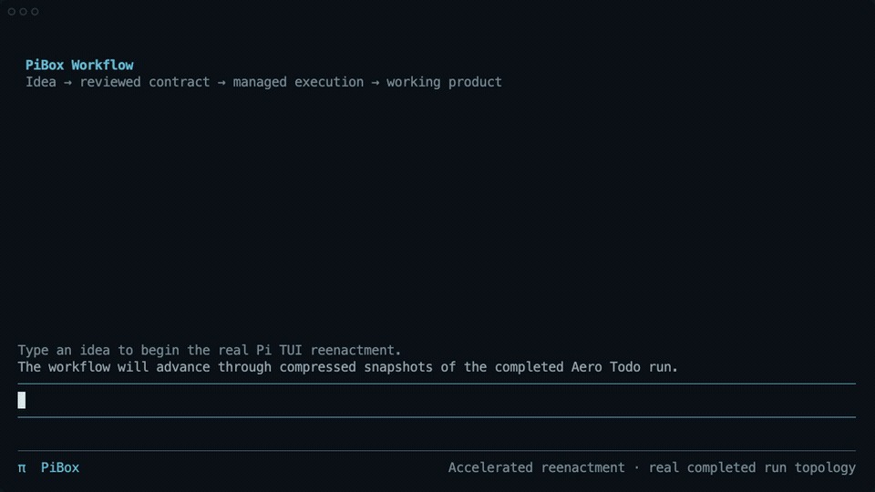
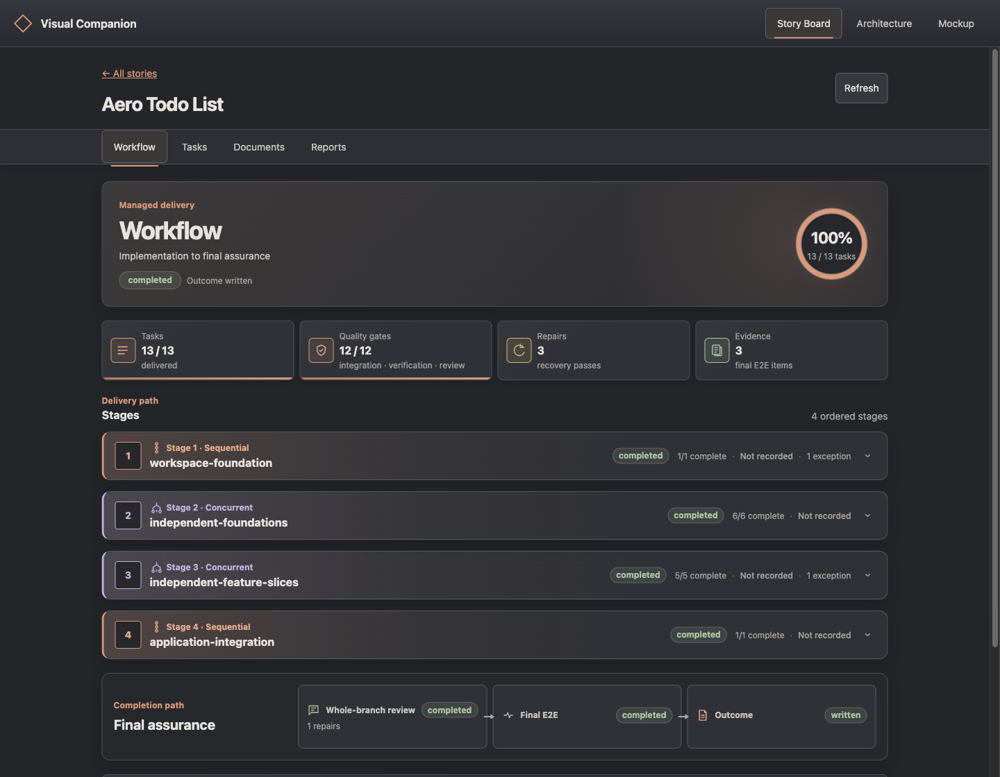

# PiBox

PiBox is an extension pack for the [Pi coding agent](https://github.com/badlogic/pi-mono). It combines a focused terminal experience with safer delegation, local tools, and an optional managed workflow that can carry a reviewed idea through implementation and verification.



*An 18-second accelerated reenactment grounded in a completed PiBox run. The terminal was recorded from the real Pi TUI using the production workflow dashboard; the final screen is the delivered Aero Todo application. Intermediate timing is compressed. [View a static frame instead.](docs/assets/workflow-demo/workflow-demo-poster.png)*

## At a glance

| Layer | What PiBox adds |
|---|---|
| **Terminal** | The `rattle` theme, responsive status, compact tool output, refined input, and visible agent progress. |
| **Agents** | Activation-scoped subagents, capability tiers, provider fallback, and bounded background delivery. |
| **Workflow** | Reviewed stories and plans, sequential or concurrent stages, isolated Git worktrees, checks, review, repair, and final E2E. |
| **Control** | Repository permission rules, explicit launch gates, inherited child policy, and user-owned material decisions. |
| **Context** | Path-scoped rules, curated memory, and evidence-backed knowledge distillation without silent writes. |
| **Visual tools** | Live architecture diagrams, a designer profile, browser mockups, and optional local sound feedback. |

## Quick start

Prerequisite: [Pi 0.84.3 or newer](https://github.com/badlogic/pi-mono/blob/main/packages/coding-agent/README.md#quick-start).

From this repository:

```bash
npm install
npm run verify
pi -e .
```

`pi -e .` loads the package for one run. To keep it installed, use Pi's package manager:

```bash
pi install /absolute/path/to/PiBox
```

PiBox packages execute extension code with your user permissions; review the source and configuration before installation.

## From idea to working product


The main agent helps turn an open-ended request into a product contract and a separate delivery plan. You review both boundaries before anything runs. After an explicit start, PiBox owns scheduling, worktree isolation, deterministic checks, integration, bounded repair, whole-branch review, and final E2E. Material decisions and exhausted recovery return to you rather than silently changing the contract.

```text
/harness init [standard|economy]
/workflow status

Discuss the idea → review the story → review the plan → say “start the workflow”
```

Managed execution is unattended only within the current live Pi activation; quitting is treated as a crash, not as detached background operation. See [the workflow guide](docs/workflow.md) for authoring, execution, recovery, and evidence details.

### Inspect delivery at a glance



*The read-only Visual Companion view of the completed Aero Todo delivery: 13 tasks across four ordered stages, three recovery passes, final review, E2E, and written outcome.*

## Everyday controls

| Control | Purpose |
|---|---|
| `/thinking` | Select a model-compatible thinking level. |
| `/tier-profile` | Switch the active agent routing profile. |
| `Shift+Tab` or `/permissions` | Switch between enforced and bypass permission modes. |
| `/services` | Inspect or control local PiBox services. |
| `/distill` | Turn a reviewed code, release, workflow, or session range into evidence-backed proposals. |
| `/skill:architecture-visualizer` | Open a live architecture explanation in the Visual Companion. |
| `pi --profile designer` | Start the repository-aware visual design workflow. |

## Documentation

- **Workflow:** [concepts and setup](docs/workflow.md) · [collaboration flow](docs/agent-collaboration-flow.md) · [E2E](docs/workflow-e2e.md)
- **Agents and models:** [agent workflow](docs/specs/agent-workflow.md) · [model tiers](docs/model-tier-guidance.md) · [provider integrations](docs/specs/provider-integrations.md)
- **Interface and design:** [visual TUI](docs/specs/visual-tui.md) · [visual diff example](examples/visual-diff/README.md)
- **Safety and context:** [permissions](extensions/permissions/README.md) · [path-scoped rules](extensions/rule/README.md) · [memory](extensions/memory-adapter/README.md) · [distillation](extensions/distill/README.md)
- **Local integrations:** [services](extensions/service-adapter/README.md) · [sound feedback](extensions/feedback/sound-hooks/README.md) · [local models](extensions/providers/local-llm/README.md) · [Ollama Cloud](extensions/providers/ollama-cloud/README.md)

MCP transport and copyrighted audio remain user-supplied. Local services start lazily and never update without explicit approval.

## Development

```bash
npm run check
npm test
npm run eval:workflow
```

Generated benchmark data stays under ignored `.benchmark/` paths. The deterministic workflow scenarios cover stage scheduling, checks, review, repair, recovery, and completion boundaries.

## License

MIT
